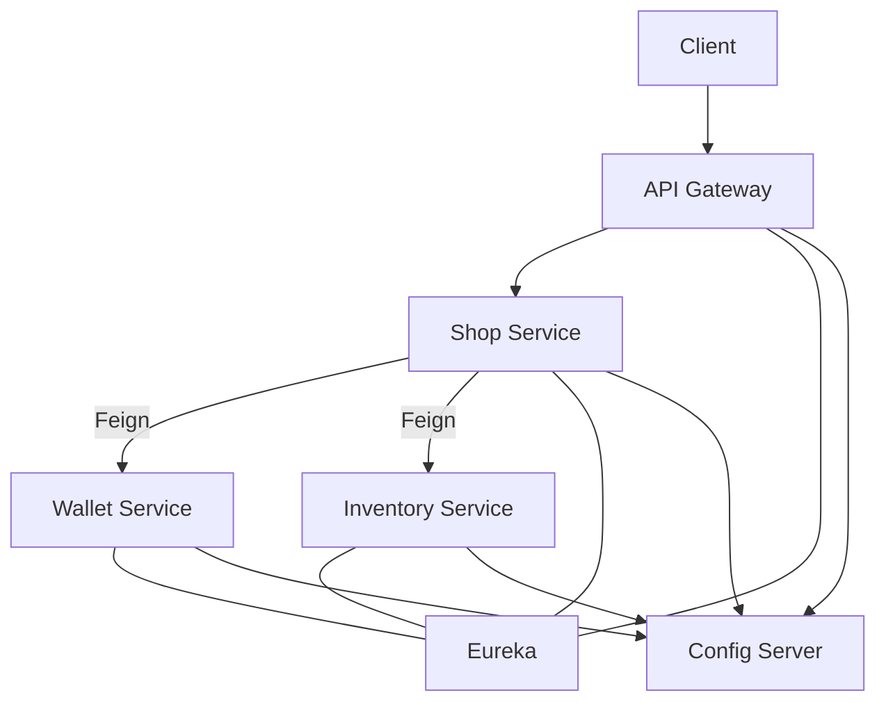

# 🛒 E-Commerce Microservices 

## ✨ الفكرة في سطرين (TL;DR)

المشروع ده E-Commerce معمول بـ **Spring Boot + Spring Cloud** على شكل **Microservices**.
الـ**Shop Service** بتنسّق الأوردر: تسأل **Inventory** عن الأسعار والستوك، تسحب فلوس من **Wallet**، وبعدين تخصم الستوك. فيه **Gateway** بيعدّي كل الريكوستات، و**Eureka** للاكتشاف، و**Config Server** للكونفيج من GitHub. فيه **Circuit Breakers** و**Retry** عشان السيستم يبقى متماسك حتى لو فيه خدمة وقعت.

---

## 🧩 الخدمات (بالمختصر)

* **API Gateway (8090)**
  Entry point واحد. بيوزّع الريكوستات على الخدمات، وعليه خفيف **CircuitBreaker** على `/wallet` و`/inventory`.

* **Shop Service (8082)**
  الـOrchestrator. بيعمل الأوردر، يكلم **Wallet** و**Inventory** بـ **Feign**. فيه **Resilience4j** + **Compensation** (Refund لو خصمنا فلوس وبعدين الستوك فشل).

* **Wallet Service (8081)**
  فلوس العميل: **withdraw/deposit**. قاعدة بيانات منفصلة.

* **Inventory Service (8083)**
  منتجات وستوك: **check** (سعر+كمية) و**consume** (خصم/حجز). قاعدة بيانات منفصلة.

* **Eureka (8761)**
  Service Discovery. كل خدمة بتسجّل اسمها وهتلاقي الباقي بالـ name (lb://...).

* **Config Server (8888)**
  كونفيج مركزي من **GitHub repo** (`config/application.yml` + `config/*-service.yml`).

---

## 🔄 الـWorkflow بتاع الأوردر (بسيط وواضح)

1. **Client → Gateway**
   العميل يبعت على `/shop/**`.

2. **Gateway → Shop**
   الجيتواي يوجّه للـ **shop-service**.

3. **Shop → Inventory (check)**
   يشوف كل Product: **سعر + كمية متاحة**. الأسعار تيجي من Inventory (source of truth).

4. **Shop → Wallet (withdraw)**
   لو كله متاح، نسحب **الإجمالي** من محفظة العميل.

5. **Shop → Inventory (consume)**
   نخصم/نحجز الستوك فعليًا.

6. **لو تمام** → الأوردر يبقى **CONFIRMED** ويتسجّل.

7. **لو الستوك فشل بعد السحب** → **Compensation**: نعمل **Refund** للمحفظة ونرجّع Error مرتب.

> ⛑️ **Resilience**:
>
> * Shop فيه **CircuitBreaker + Retry** على مكالمات Feign.
> * Gateway عنده **CircuitBreaker** على `/wallet` و`/inventory` عشان fallback ظريف لو الخدمات دي وقعت.
> * `/shop/**` بنسيبه شفاف عشان يشوف الـclient الحقيقة من orchestrator.

---

## 🕸️ شكل التواصل (Mermaid)

---

## 📝 ملاحظات سريعة

* **DB per Service**: كل خدمة بقاعدتها؛ مفيش ربط سكيمات.
* **Feign + Eureka**: مكالمات بالاسم مش بالـ IP.
* **Config Server**: الكونفيج من GitHub (shared + per-service).
* **Errors**:

  * **503**: خدمة تحتها مش متاحة (upstream down).
  * **502**: الجيتواي مقدرش يكمل (timeouts/استجابة بايظة).
* **Refund Logic**: لو الفلوس اتسحبت وبعدين الستوك وقع، بنعوّض فورًا.

---

## ⚙️ باختصار المشروع ده إيه؟

سيستم صغير يورّيك **إزاي تعمل Order end-to-end** في Microservices:
**Check → Charge → Reserve → Confirm**، ومعاه **حِماية** (Circuit Breakers/Retry) و**تعويض** (Refund) لو الدنيا كبّرت.
سهل تتبعه، ويلمع في **مناقشة** أو **Portfolio** 👌
